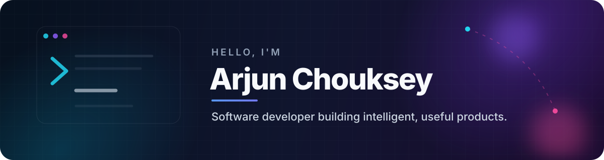

  

  
  
  

## Hello — I'm Arjun 👋

I'm a software developer who enjoys turning repetitive problems into useful products. My work sits at the intersection of **AI, full-stack engineering, and practical automation** — from real-time messaging systems to document intelligence and recommendation engines.

- 🔭 Building full-stack products and AI agents
- 🧠 Exploring applied ML, semantic search, RAG, and document intelligence
- 🛠️ I care about thoughtful UX, clean architecture, and software that solves a real problem
- 🎸 Away from the keyboard, you'll usually find me playing guitar

## Selected work

<table>
  <tr>
    <td width="50%" valign="top">
      <h3><a href="https://github.com/arjun-chouksey/signal-clone">Signal Clone</a></h3>
      
A responsive real-time messaging platform with direct and group chat, typing indicators, delivery receipts, reactions, replies, and disappearing messages.

      
<code>Next.js</code> <code>TypeScript</code> <code>FastAPI</code> <code>Socket.IO</code> <code>SQLite</code>

    </td>
    <td width="50%" valign="top">
      <h3><a href="https://github.com/arjun-chouksey/Adobe-India-Hackathon-2025">Adobe India Hackathon</a></h3>
      
Containerized document-intelligence tools for PDF outline extraction and persona-aware semantic ranking, built for speed and CPU-only execution.

      
<code>Python</code> <code>ONNX</code> <code>MiniLM</code> <code>PyMuPDF</code> <code>Docker</code>

    </td>
  </tr>
  <tr>
    <td width="50%" valign="top">
      <h3><a href="https://github.com/arjun-chouksey/shl-recommender">SHL Assessment Recommender</a></h3>
      
A natural-language recommendation system that matches hiring needs to relevant assessments through semantic search and Gemini-powered reasoning.

      
<code>Python</code> <code>Gemini</code> <code>FastAPI</code> <code>Streamlit</code>

    </td>
    <td width="50%" valign="top">
      <h3><a href="https://github.com/arjun-chouksey/CodeRadar">CodeRadar</a></h3>
      
A responsive hub for discovering upcoming and past Codeforces and LeetCode contests, with filters, countdowns, and reminders.

      
<code>React</code> <code>TypeScript</code> <code>Node.js</code> <code>Express</code> <code>MongoDB</code>

    </td>
  </tr>
</table>

### Also worth exploring

- [ColdConnect](https://github.com/arjun-chouksey/Gen-Ai-Project--ColdConnect) — turns job listings into personalized outreach using Groq, LangChain, ChromaDB, and Streamlit.
- [Chat Sentiment Analysis](https://github.com/arjun-chouksey/chat-sentiment-analysis) — applied natural-language processing for understanding conversation sentiment.

## Toolbox

## GitHub snapshot

  
  

---

  <strong>Have an interesting problem to solve?</strong> 
  <a href="mailto:cyarjun333@gmail.com">Let's build something useful.</a>

